# Hurdle Tracker
https://www.hurdl.us/

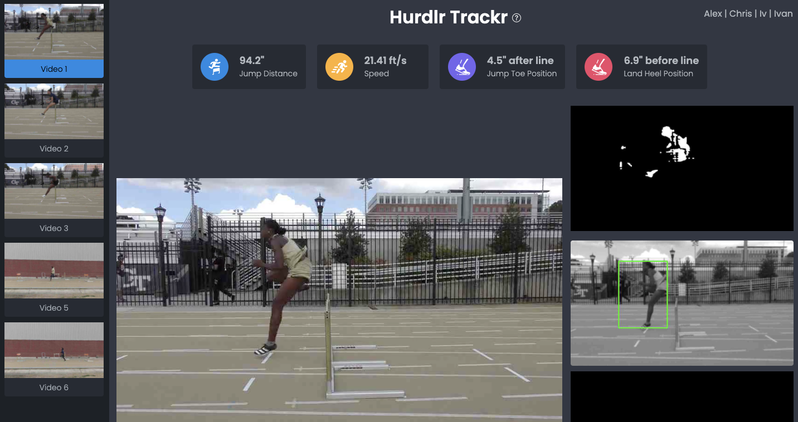

The goal of this project is to come up with a pipeline to extract as much information as possible from videos of athletes jumping over hurdles, which can help athletes fine tune their jumps over time.
        
We were provided 6 videos of athletes jumping over hurdles filmed with a monocular camera. We broke down the problem into two parts: 1) Detecting when the athlete makes the jump and lands 2) Estimating the distance of the jump based on the camera position and objects on the field.

### 1. Detecting when the athlete makes the jump

We initially explore using pose detection, both 2D and 3D models. Unfortunately these and other machine learning models (such as segmentation) are not trained on uncommon positions, such as in the middle of a sprint or jump. Some experimentation also seems to indicate there is still racial bias on these models which worked best for white athletes. 

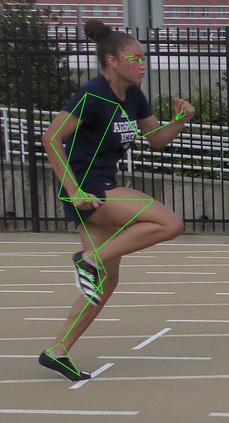  |  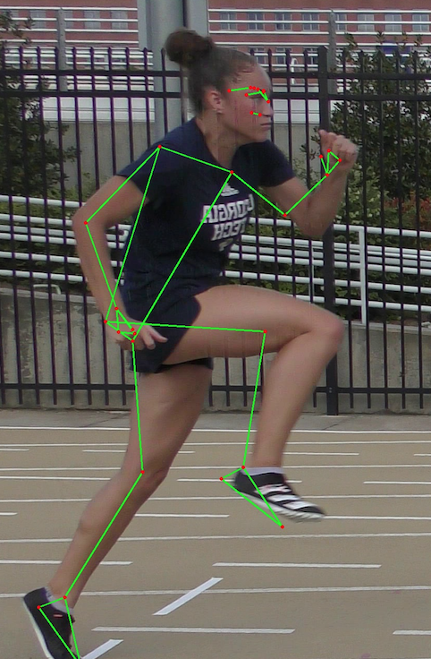 | 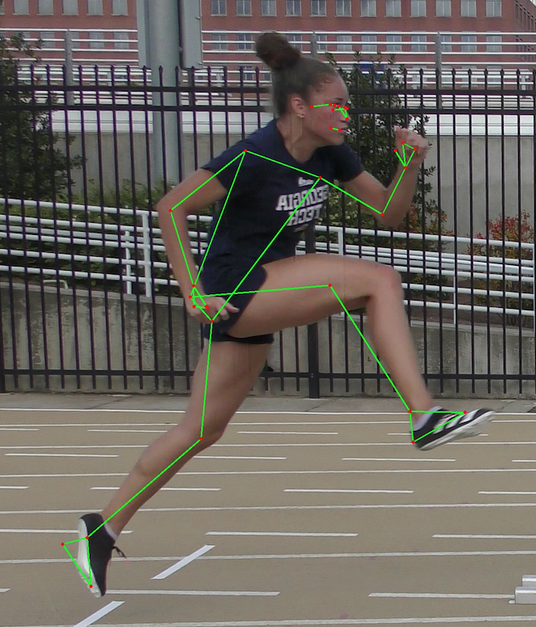

We next then tested a simpler approach with object detection, semantic segmentation, and we found that since the camera is fairly stationary, a simple background subtraction model works well. We tested different background subtraction models and landed on BackgroundSubtractorMOG. To improve the accuracy of the model, we first applied grayscale to the image, along with some gaussian blur to filter out minor details, then performed the background subtraction. We performed background subtraction iteratively on each frame, and updated the model as the video progressed. The resulted segmentation was still noisy, so we used openCV's morphology transformation to remove small patches and fill in gaps in large blobs.

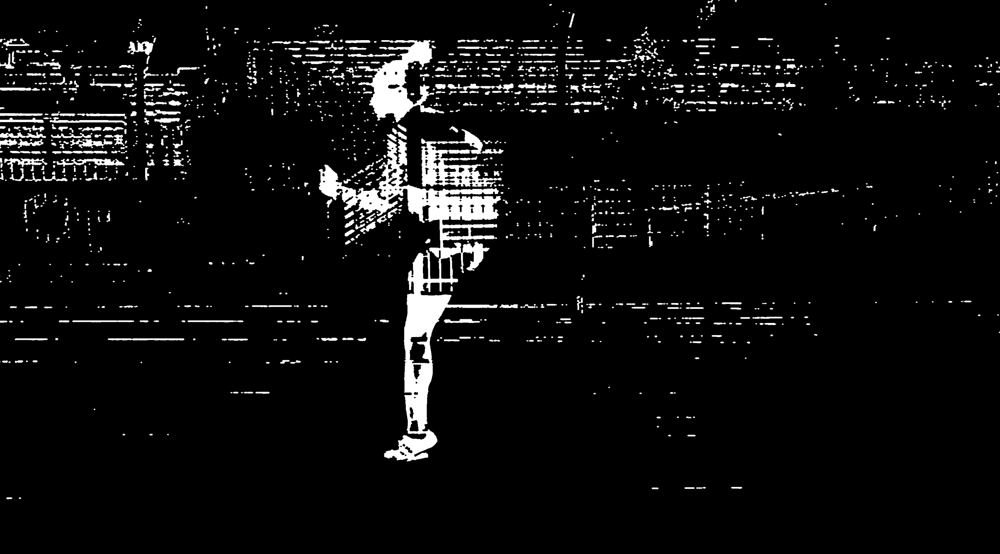  |  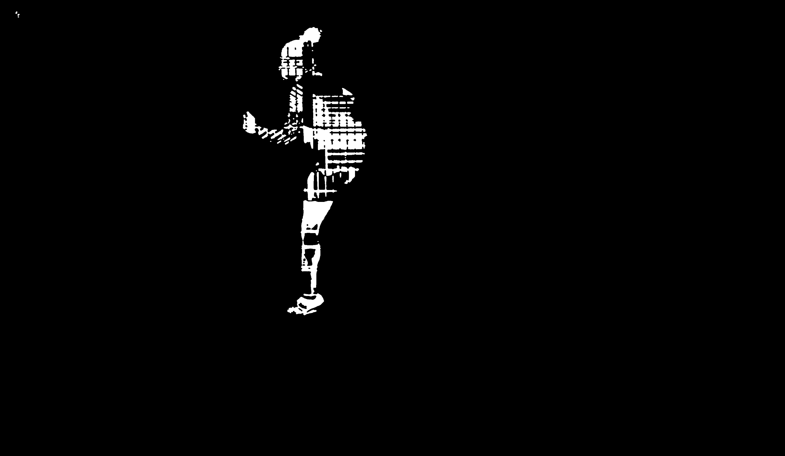

We then applied the YOLO object detection algorithm to find the bounding box of the athlete, and then find the largest blob within that bounding box by finding the largest contour.

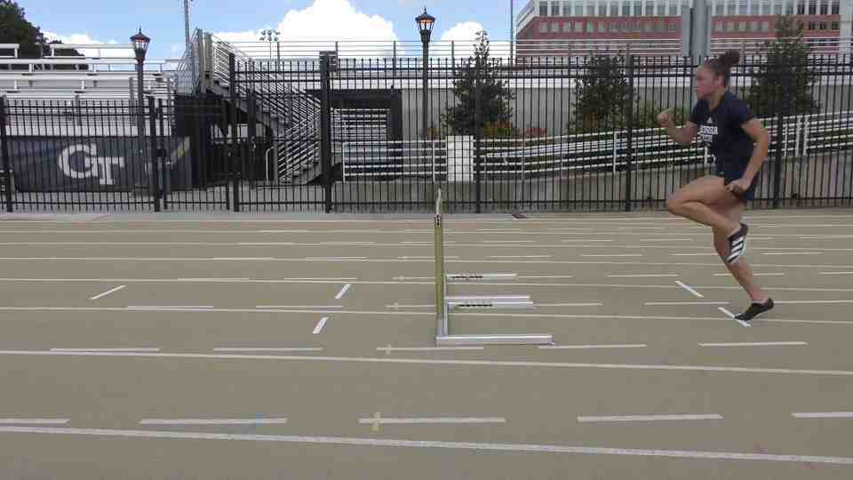  |  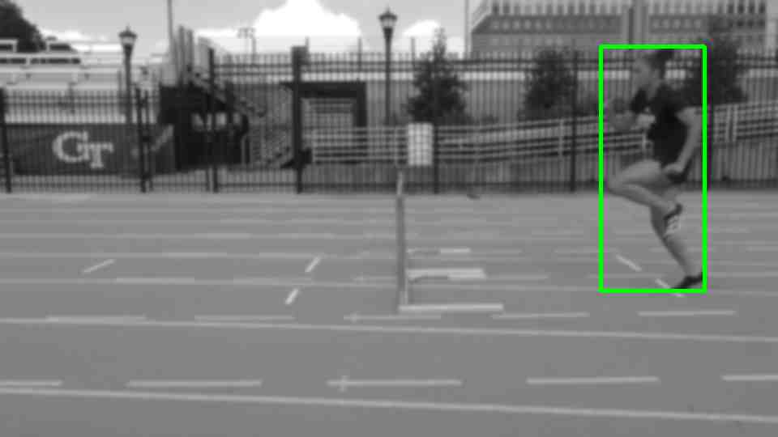

Once we have a somewhat clear segmentation of the athlete frame by frame, we can proceed to find the jump and landing frames. We removed the top half of the human blob and focused on the legs, and tracked the lowest points of the human blob across the video. From analyzing the rise and fall of the lowest point of the human blob, we can identify when steps occur. Using this information, we computed the distances between each step, and marked the largest step as the jump.

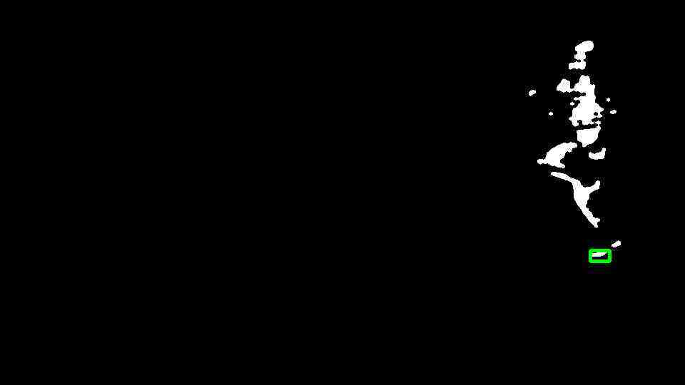

Once we have the jump and landing frames, we can zoom in on the foot pixels, and calculate the pixel at the toe and heel of the foot when both jumping and landing.

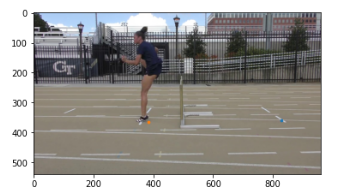  |  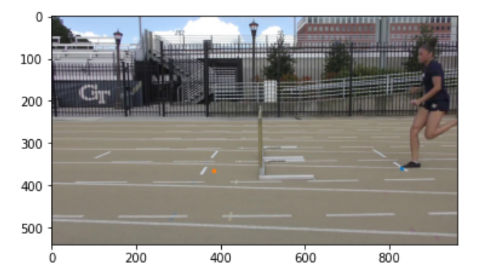

### 2. Estimating distance based on camera position
Most robust distance measurements in computer vision requires at least two cameras. Since we only have one stationary camera to work with (monocular vision) we have to get creative. We used OpenCV's SolvePNP, by collecting some real world coordinates in scene (such as by knowing the distance between the track lines are 105.5 inches, and the hurdle is 30 inches tall), and by mapping those points to the 2d pixel plane. SolvePNP then iterates through different possible projections and returns the one that fits those constraints.

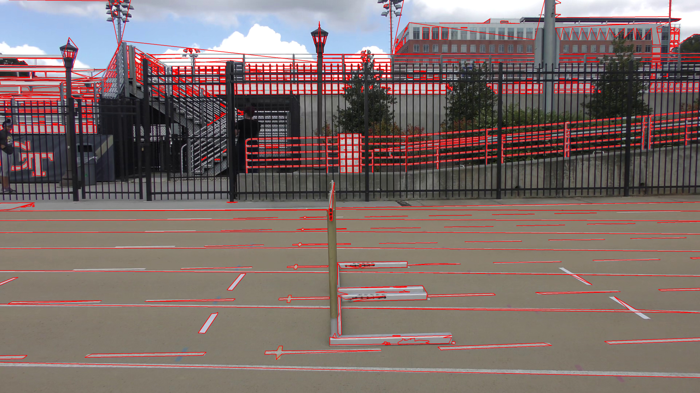  |  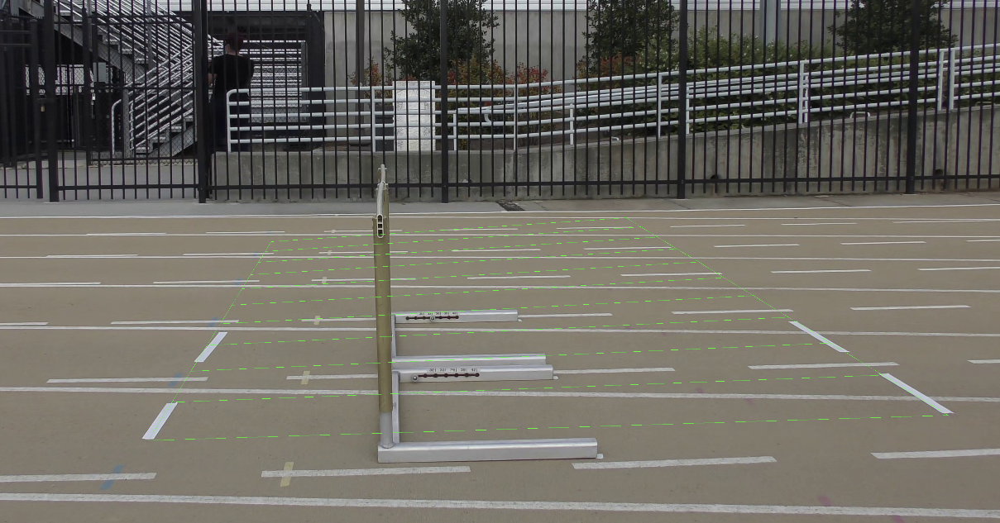

In order to find the 2d pixel points of the track lines, we take the first frame of the video (when the athlete is not present), strip the top half of the image, and apply a threshold to highlight the white-ish parts, which usually corresponds to the track lines. Using the jump / landing frames from step 1 as well as the pixels from the athlete's foot when jumping / landing, we can isolate the track lines closest to the feet. In order to identify the jump / landing lines separate from track lines, we used OpenCV's HoughLinesP to detect lines from our processed image, then clustered and filtered lines based on angle and position.

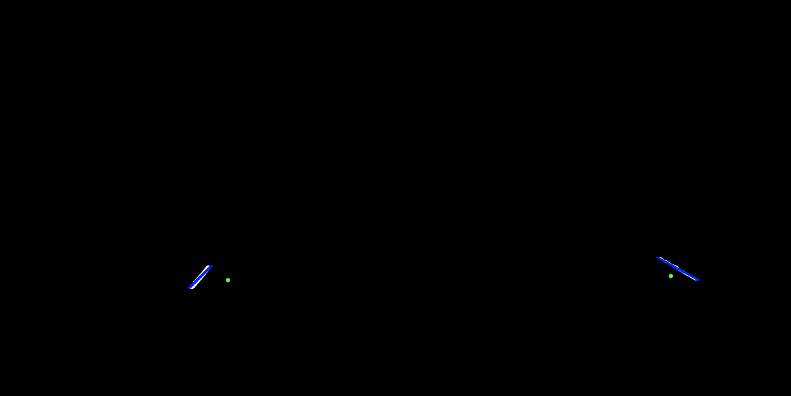

# Development
## Set up
* git submodule update --init
* Download model https://drive.google.com/open?id=1_2CCb_qsA1egT5c2s0ABuW3rQCDOLvPq and place in flask/models/
* pip3 install virtualenv
* cd flask
* virtualenv venv
* source venv/bin/activate
* pip3 install -r requirements.txt

## Starting Flask server
* cd flask
* export FLASK_APP=main.py
* flask run
* Navigate to http://localhost:5000/

## Debugging Flask server (assuming)
* Run `python -m debugpy --listen 0.0.0.0:5678 -m flask run --host=0.0.0.0 --reload`
* Go to the `Run` sidebar in VSCode and run `Python: Remote`
* Set breakboint in main.py
